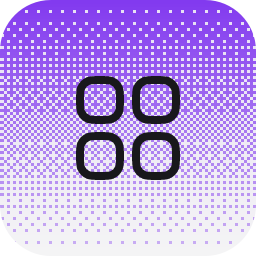

<p align="center">
  <picture>
    <source media="(prefers-color-scheme: dark)" srcset="./icon-dark.png" />
    
  </picture>
</p>

<div align="center">

# Dashboards

</div>

A customizable, constantly-updating grid of widgets.

> **The public home of `ryu-dashboards`.** Source, builds, and releases live here —
> binaries for every platform are attached to each release.
>
> This tree is generated from the Ryu monorepo, so commits pushed here
> directly are replaced on the next sync. **Pull requests are welcome** —
> open them here and they are ported into the monorepo, then flow back out.
> Ryu as a whole: https://github.com/amajorai/ryu

## Install

**App:** [Install](ryu://apps/@ryu/dashboards) (opens the Ryu desktop app and asks you to confirm)

**CLI:**

```bash
ryu apps add @ryu/dashboards
```

**Crate:**

```bash
cargo install ryu-dashboards
```

Prebuilt binaries for every platform are attached to [each release](https://github.com/amajorai/ryu/releases).

## License

Apache-2.0 — see [LICENSE](./LICENSE).

## Layout

| Path | What it is |
|---|---|
| `backend/` | The `ryu-dashboards` Rust crate — the whole engine. |
| *(no `ui/` here)* | The UI lives in the desktop app; see below. |

The Core plugin manifest for this app is
`apps-store/dashboards/manifest.json`
(`id: @ryu/dashboards`) — a **governance shell** with zero runnables, exactly like
`research` and `teams`. Install/enable/disable + the route gate govern the app; the
implementation stays in-crate. That root `manifest.json` (no embedded HTML UI) is the
app's ONLY copy; Core compiles it in via
`include_str!("../../../../apps-store/dashboards/manifest.json")`, so the app **does**
participate in the `packaged_manifests_are_compiled_in_from_their_package_home` guard.

## Backend (`ryu-dashboards`)

An extracted Core capability crate. Core consumes it as a **non-optional** path
dependency (`apps/core/Cargo.toml` → `../../apps-store/dashboards/backend`) — the
hardware device-dashboard renderer, the `dashboard_builder` MCP runnable, and the
background refresh loop all reach its types in every build. `crates/ryu-hardware` also
depends on it for e-ink/LCD panel rendering.

> **Sidecar-ization status (2026-07-18): OUT-OF-PROCESS.** Served by the standalone
> `[[bin]] ryu-dashboards` (`kind:local`, `public_mount /api/dashboards`, port 7997, started eager)
> via the generic ext-proxy loader; Core links **zero dashboard code** (no path-dep, no in-process
> `nest_service` mount). The kernel weld (`ryu-hardware` reaching `DashboardEngine` directly + the
> SSE broadcast into the hardware nudge loop) was **inverted** behind a minimal **`DashboardFeed`
> trait** (`crates/ryu-hardware/src/feed.rs`, plain owned types), with the device-render logic moved
> into this crate's `device.rs` as the single source of truth. Core's `DashboardFeed` impl, the nudge
> loop (reads the sidecar's `/events?internal=1` SSE, viewer cost-guard preserved), and the
> `dashboard_builder` MCP runnable all reach the sidecar over loopback via `dashboards_client`, so a
> decoupled node renders device dashboards byte-identically.

- **SQLite store** (`store.rs`): dashboards and their widget layout, `rusqlite` (bundled).
- **Widget-source resolution** (`sources.rs`): the three cross-cutting couplings (Gateway
  URL/token for Composio, the agent runner for agent widgets, and the SSRF-guarded external
  fetch for HTTP widgets) are inverted through the `DashboardsHost` trait, so the crate has
  **zero** dependency on `apps/core`.
- **Refresh loop** (`refresh.rs`): background re-evaluation of live widget values.
- **Device-image renderer** (`render.rs`): `resvg` rasterizes the widget SVG onto a
  pure-Rust `tiny-skia` pixmap (no headless browser, no system deps) and down-converts to
  1-bit / rgb565 for hardware firmware.
- **HTTP surface** (`api.rs`) — the `/api/dashboards/*` router (list/create/read/update
  dashboards + widget CRUD) plus an **SSE** event stream of live widget values. Core nests
  it at `/api/dashboards` behind the App route gate.

Run its tests with `cargo test -p ryu-dashboards`.

## UI — desktop-native, canvas tier (by design)

The dashboard editor and renderer are **desktop-native React**, not a sandboxed companion:

- `apps/desktop/src/components/dashboard/` — `DashboardCanvas`, `DashboardGrid`,
  `WidgetCard`, `AddWidgetDialog`, `DashboardBuilderChat`, and the `widgets/` catalog.
- Served as the desktop **Home** dashboard at the path this manifest declares
  (`contributes.sidebar_buttons[].target` — currently `/dashboard`). The desktop mints
  that route from the live contributions feed
  (`apps/desktop/src/contributions/app-shell-routes.ts`), so moving the page is a
  manifest edit and the route disappears when the app is disabled. It was hardcoded at
  `/home` in shell code; a restored session rewrites that old path.

### Why canvas-tier and not a companion iframe

Home is the app's front door. A sandboxed companion iframe (the shape used by quests,
monitors, mail, etc.) is the right call for a self-contained feature panel, but it would
wreck the Home dashboard UX: drag-to-arrange grid interactions, live in-process widget
rendering, and the deep integration with the shell (navigation, theming, the builder
chat) all want first-class desktop-native rendering. So Dashboards deliberately sits at
the **canvas tier**, the same tier as the workflow canvas (`WorkflowCanvas`), with the
backend as a shared crate and the UI compiled into the desktop app.
